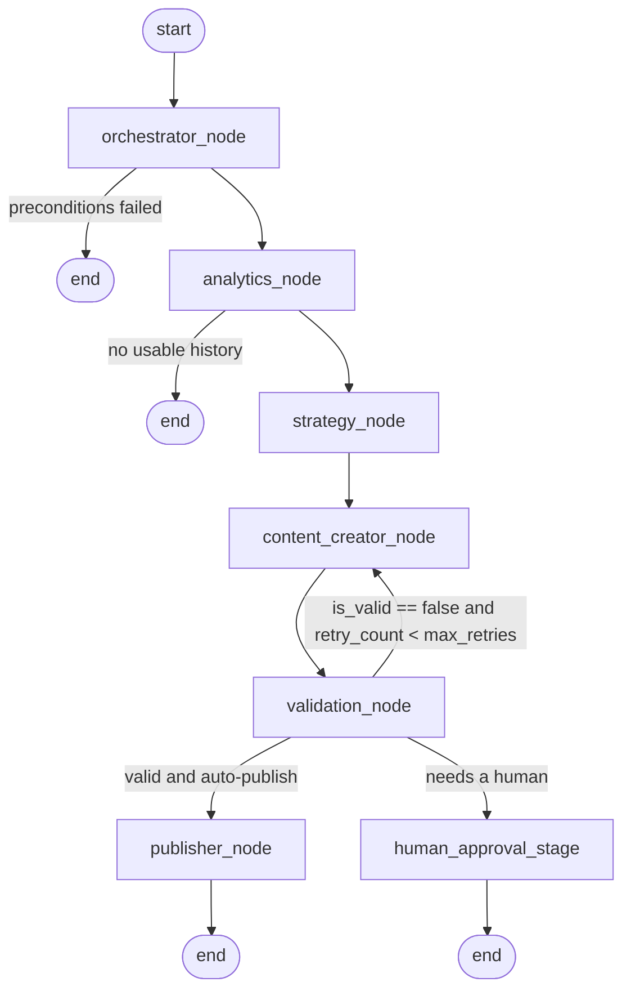

# SocialAgent AI

A multi-agent social media growth platform. It reads a business account's own
performance history, decides what to publish next, writes it, checks it against
platform policy and the brand's voice, and then either publishes it or parks it
for a human.

The pipeline is a [LangGraph](https://langchain-ai.github.io/langgraph/)
`StateGraph`. Six agents pass one typed state object between them, and the one
non-linear edge — the validation gate — is the point of the design: content that
fails is sent back to its author with a structured critique, at most twice, and
anything still unresolved goes to a person rather than to the account.



`GET /api/v1/pipeline/graph` returns the same diagram generated from the
compiled graph, so it cannot drift from the code.

## The agents

| Node | What it owns | LLM? |
| --- | --- | --- |
| `orchestrator_node` | Preconditions, goal normalisation against live connections, routing | no |
| `analytics_node` | Fetches history per platform, computes engagement/retention/posting windows, then interprets them | for the interpretation only |
| `strategy_node` | Topic clusters, per-platform recommendations, KPI targets | yes (schedule is computed) |
| `content_creator_node` | Platform-native copy, scripts, hashtag strategy; revisions against a critique | yes |
| `validation_node` | Policy sweep, format rules, brand-voice and safety scores, `CritiqueReport` | for the two scores only |
| `publisher_node` | Token refresh, dispatch through the platform connector | no |
| `human_approval_stage` | Approval queue for anything that must not auto-publish | no |

Everything a downstream node depends on numerically is computed in Python —
engagement rates, retention, best posting windows, caption limits, hashtag
density, video runtime. The LLM contributes judgement (themes, angles, copy,
tone and risk scores) and can never overrule a hard limit: a deterministic
blocker fails a draft regardless of what the model scored it.

## Layout

```text
social_agent_ai/
├── app/
│   ├── api/            # FastAPI routers: auth, pipeline, posts, webhooks
│   ├── core/           # config, logging, security, database, llm, platform_rules
│   ├── agents/
│   │   ├── state.py    # AgentState (TypedDict) + read helpers + snapshot
│   │   ├── graph.py    # StateGraph, conditional edges, run_pipeline()
│   │   ├── prompts.py  # one system prompt per agent
│   │   └── nodes/      # orchestrator, analytics, strategy, content_creator,
│   │                   # validation, publisher (+ human_approval_stage)
│   ├── services/       # Meta / YouTube / TikTok connectors, OAuth, token store,
│   │                   # vector store, sandbox, run store
│   └── models/         # schemas.py (domain), api.py (wire), db.py (SQLAlchemy)
├── tests/
├── .env.example
├── main.py
├── pytest.ini
├── ruff.toml
└── requirements.txt
```

## Running it

```bash
python -m venv .venv && source .venv/bin/activate
pip install -r requirements.txt
cp .env.example .env          # works as-is for a first run
uvicorn main:app --reload
```

With an empty `.env` the service starts in **offline mode**: `LLM_PROVIDER=echo`
and the sandbox connectors stand in for the platform APIs, so you can drive the
whole pipeline before registering a single platform app.

```bash
curl -XPOST localhost:8000/api/v1/pipeline/run \
  -H 'X-Dev-User-Id: demo' -H 'content-type: application/json' \
  -d '{"platforms":["instagram","youtube"],"wait":true,
       "goals":{"objective":"grow qualified leads","posts_per_platform":1}}'
```

`POST /api/v1/pipeline/run` returns `202` with a `run_id` and executes the graph
in the background; `"wait": true` blocks and returns the finished snapshot
instead. Interactive docs are at `/docs`.

### Going live

1. Set `ANTHROPIC_API_KEY` and `LLM_PROVIDER=anthropic`.
2. Register the platform apps and fill in the `META_*`, `YOUTUBE_*` and
   `TIKTOK_*` credentials. A platform with credentials gets its real connector;
   one without falls back to the sandbox, so you can roll out per platform.
3. Set `SECRET_KEY` (32+ bytes) and `TOKEN_ENCRYPTION_KEY` (a Fernet key).
   `APP_ENV=production` refuses to boot without them.
4. Point `DATABASE_URL` at Postgres/Supabase and swap the in-memory
   `TokenStore` / `RunStore` for database-backed ones (`app/models/db.py` has
   the tables).
5. `AUTO_PUBLISH_ENABLED=false` (the default) routes everything through human
   approval. Turn it on per account via `goals.auto_publish`.

## Endpoints

| Method | Path | Purpose |
| --- | --- | --- |
| `POST` | `/api/v1/pipeline/run` | Trigger the workflow |
| `GET` | `/api/v1/pipeline/runs` | Recent runs |
| `GET` | `/api/v1/pipeline/runs/{run_id}` | Full run snapshot |
| `GET` | `/api/v1/pipeline/runs/{run_id}/drafts` | Drafts a run produced |
| `GET` | `/api/v1/pipeline/graph` | Mermaid diagram of the compiled graph |
| `GET` | `/api/v1/auth/{platform}/start` | Begin OAuth |
| `GET` | `/api/v1/auth/{platform}/callback` | OAuth redirect target |
| `GET`/`DELETE` | `/api/v1/auth/connections[/{platform}]` | List / disconnect accounts |
| `POST` | `/api/v1/auth/brand-voice` | Store tone-of-voice snippets |
| `GET` | `/api/v1/posts/pending` | Approval queue |
| `POST` | `/api/v1/posts/{run_id}/drafts/{draft_id}/decision` | Approve, edit or reject |
| `GET`/`POST` | `/api/v1/webhooks/meta`, `/api/v1/webhooks/tiktok` | Platform callbacks |
| `GET` | `/health`, `/health/ready` | Liveness and readiness |

## Security notes

- OAuth tokens are Fernet-encrypted before they reach storage and decrypted
  only in-process, immediately before a connector call.
- OAuth `state` is HMAC-signed and bound to the user and platform, so a
  callback cannot be replayed against another account.
- Meta webhooks are rejected unless `X-Hub-Signature-256` verifies.
- Writes to platform APIs are never retried — a duplicate post on a client's
  account is worse than a failed one. Reads retry with jittered backoff.

## Testing

```bash
pytest          # 93 tests, fully offline
ruff check .
```

The suite covers the state helpers, every branch of the validation edge, the
deterministic analytics maths, each guardrail, the bounded retry loop end to
end (exactly two revisions, then escalation), credential encryption, connector
parsing, and the HTTP surface including the approval round trip.

## Extension points

- **A new platform**: implement `SocialConnector` (see `app/services/base.py`),
  add its limits to `PLATFORM_RULES`, register it in
  `app/services/registry.py`.
- **A real vector store**: `QdrantBrandVoiceStore` takes any embedding
  function; register it with `set_brand_voice_store()`.
- **Resumable runs**: pass a LangGraph checkpointer to `compile_pipeline()`.
  The run id is already used as the `thread_id`.
- **A different model provider**: implement the `LLMClient` protocol
  (`complete` + `parse`) and register it with `set_llm_client()`.

## Not yet implemented

These are deliberate seams rather than oversights, and each one is marked in
the code:

- **Media rendering.** The content agent writes a `media_brief` and a script;
  it does not produce video or images. Instagram, TikTok and YouTube publishing
  requires `media_asset_url` to point at a rendered asset (for YouTube, a
  `youtube://<video_id>` from a completed resumable upload).
- **Persistence.** `TokenStore`, `RunStore` and the brand-voice store are
  in-memory by default; the SQLAlchemy tables exist but no repository layer
  binds them yet, and there are no Alembic migrations.
- **Webhook processing.** Meta and TikTok callbacks are verified and logged,
  but nothing yet reconciles a TikTok `publish_id` with its draft.
